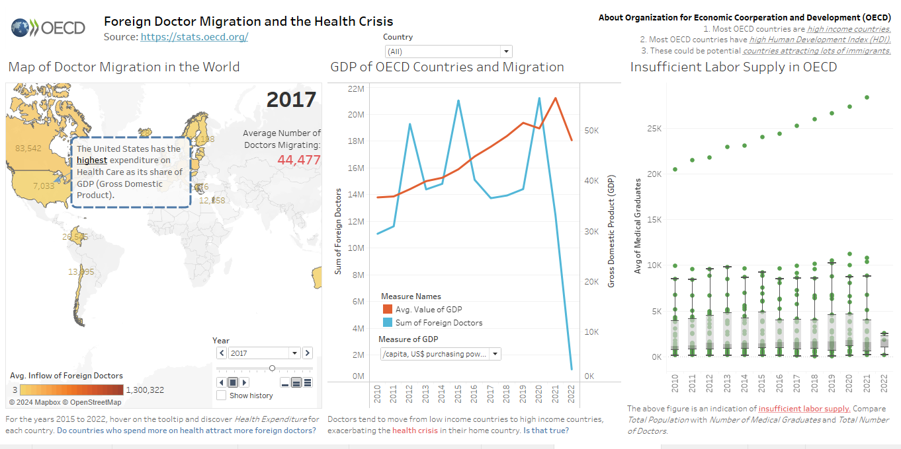

# Econometric_Analysis_of_Domestic_Doctor_Labor_Supply
This project explores the question: "Does Migration Exacerbate Domestic Labor Supply in Healthcare?".  
Data: OECD Statistics (24 OECD countries out of 38 countries).  
Main keytakeaway: 

> Observed a negative correlation between domestic labor supply and foreign doctor migration where,
> a 1% increase in Number of Foreign Doctors Per 1000 people leads to 0.22% decrease in number of domestic doctors per 1000 people. 
> Keeping all other explanatory variables constant.

Kindly find the Model Interpretation presentation [here.](https://docs.google.com/presentation/d/1w0zTjAKUdtCZbffnUG3EMRmjcUv2T4RspVwW8S1LCKY/edit#slide=id.p) or check out the pdf verison in this repository.  
Kindly find the Tableau Dashboard (without regression model) [here.](https://public.tableau.com/views/YakshDashboardEconometricAnalysis/FinalDashboardYaksh?:language=en-US&:sid=&:display_count=n&:origin=viz_share_link) (with interactivity) 

